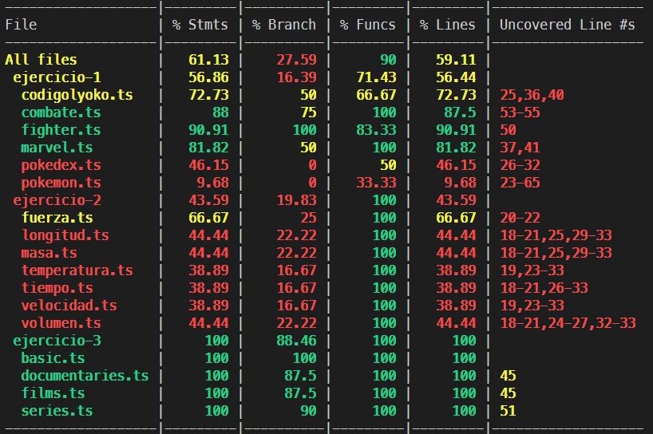

# Practica 6 - DSI

## Yeixon Reinaldo Morales Gonzalez
---
<br>

[](https://coveralls.io/github/ULL-ESIT-INF-DSI-2021/ull-esit-inf-dsi-20-21-prct06-generics-solid-Yeixon98?branch=master)

### Indice
1. [Introducion](Intro)
2. [Objetivos](Obj)
3. [Tareas Previas](TP)
4. [Ejercicios](Ejer)
5. [Documentacion](Docs)
6. [Cubrimiento](Cover)

***

## 1- Introducción <a name="Intro"></a>

Práctica en donde se desarrollarán distintos problemas propuestos. La intencionalidad detrás de esta practica es el desarrollo de las capacidades de los alumnos para resolver problemas y manejarse en un entorno TypeScript, en particular haciendo uso de las clases abstractas, typos de datos e interfaces.

***
## 2- Objetivos <a name="Obj"></a>

El objetivo de esta práctica es aprender a manejar clases abstractas e interfaces genéricas, además de realizar ña documentación del código con la herramienta Typedoc y testear las funciones con el uso de las herramientas mocha y chai. Por último configuraremos las herramientas Instanbul y Coveralls para generar informes sobre el cubrimiento del código fuente.

***
## 3- Tareas Previas <a name="TP"></a>

Antes de la realización de la práctica ha sido necesario consultar la documentación acerca de las herramientas que generan informes de cubrimiento de código y los principios SOLID.

***
## 4- Ejercicios <a name="Ejer"></a>


***
## 5- Documentacion <a name="Docs"></a>

Para documentar el código de cada función, se deberá hacer uso de las etiquetas disponibles. Todo el texto se deberá encapsularse entre los símbolos /** */. Una gran ventaja del IDE VSCode es que con escribir los primeros caracteres para añadir comentarios, detecta automáticamente que se pretende incluir documentación, y al presionar enter, crea la estructura con las etiquetas correspondientes, donde sólo deberemos completar los espacios donde se corresponde con la descripción de los atributos y de la función.

Para poder generar la documentación, creamos un fichero typedoc.json en el que se escribe la ruta de todos los ficheros de los que se quiera realizar la documentación y se ha añadido al apartado de scripts del fichero package.json esta línea:

```
"doc": "typedoc"
```

Ahora se puede generar la documentación a partir del comando `npm run doc`. Se generará un documento html que contiene una página con la documentación de las funciones que hemos escrito.

***
## 6- Cubrimiento <a name="Cover"></a>

Para poder generar informes de cubrimiento ha sido necesario instalar las dependencias `nyc` y `coveralls`.

```
"coverage": "nyc npm test && nyc report --reporter=text-lcov | coveralls && rm -rf .nyc_output"
```

Para generar los informes es necesario que el repositorio sea público. Además, desde la web de [coveralls](https://coveralls.io/) seleccionando el repositorio al que queremos hacer seguimiento, deberemos obtener el token y colocarlo en un fichero _.coveralls.yml_. De esta manera, al ejecutar

```
npm run coverage
```

Podremos ver qué porcentaje del código está cubierto por pruebas y qué líneas de cada fichero no lo están.
